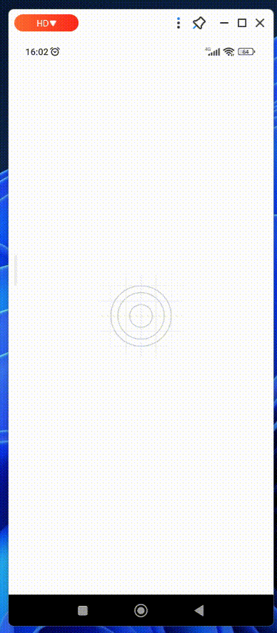
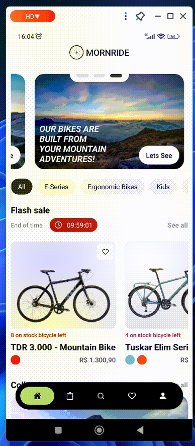
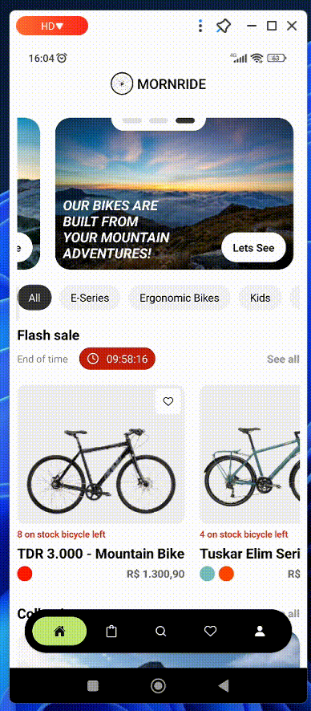
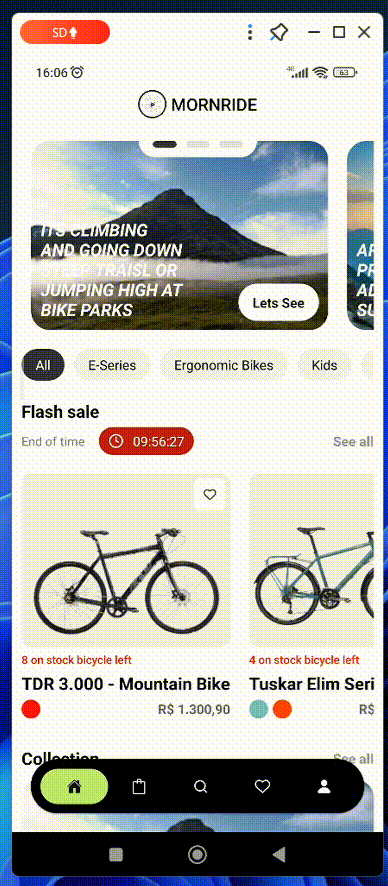
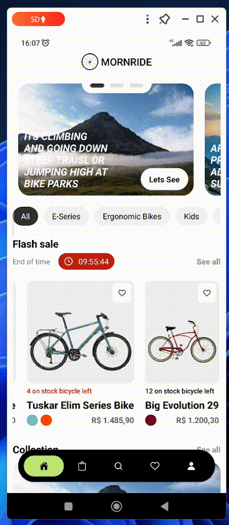
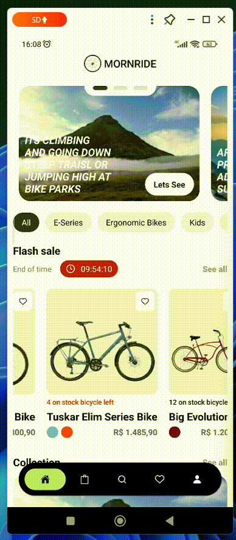

# Mornride

## Apresentação

Sabe aquela bicicleta dos sonhos, que você sempre quis ter e hoje tem oportunidade de comprar? Aqui na mornride você encontra as melhores bicicletas do mercado, tanto em questões tecnológicas, como de baixo custo e alta qualidade!!

Também temos bikes para aventuras, para as crianças e os aventureiros de plantão. Em um só espaço, uma variedade imensa de opções.

## Especificações do Projeto

### Tecnologias

- React Native Expo (0.72)
- Backend: .NET Framework 6
- Redis Database (Redis OM)

Link para o backend: https://github.com/Rafags13/MornrideApi

## Telas em funcioamento

### Tela inicial

 

### Coleções

 

### Filtros

 

### Escolha novas cores

 

### Carrinho

 

### Detalhes da bicicleta

 

### Busque um modelo novo

 

### Suas bikes favoritas

 

### Perfil
